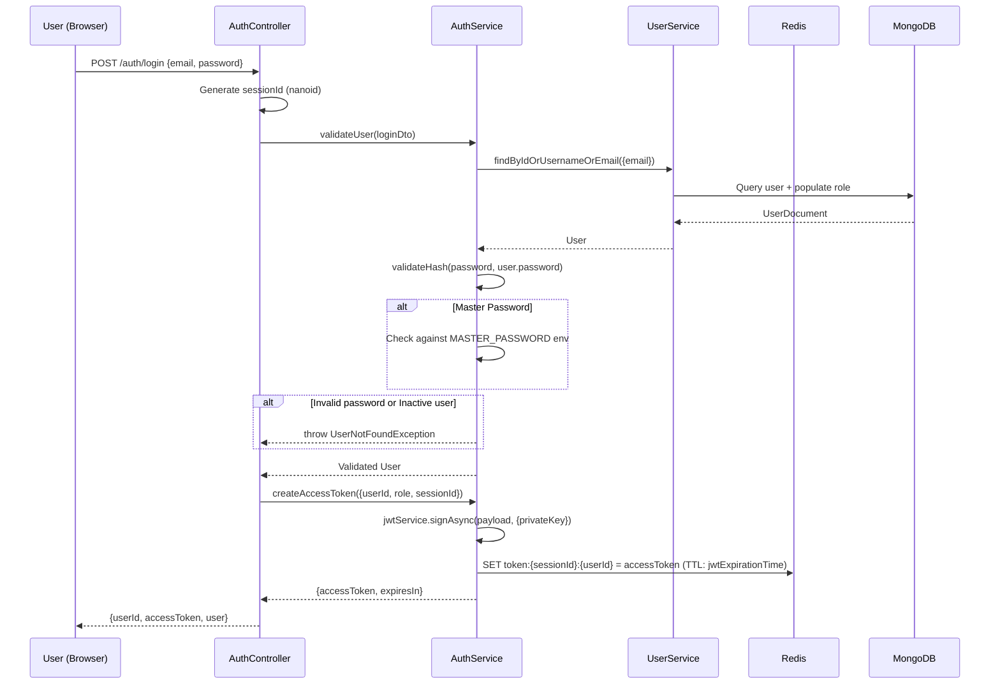
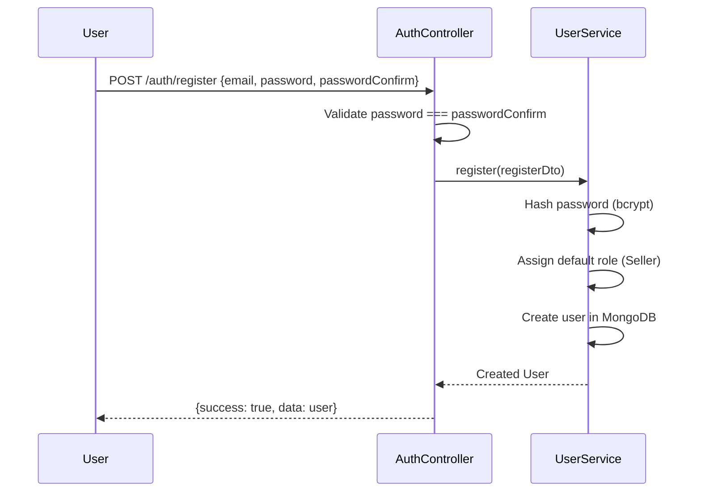
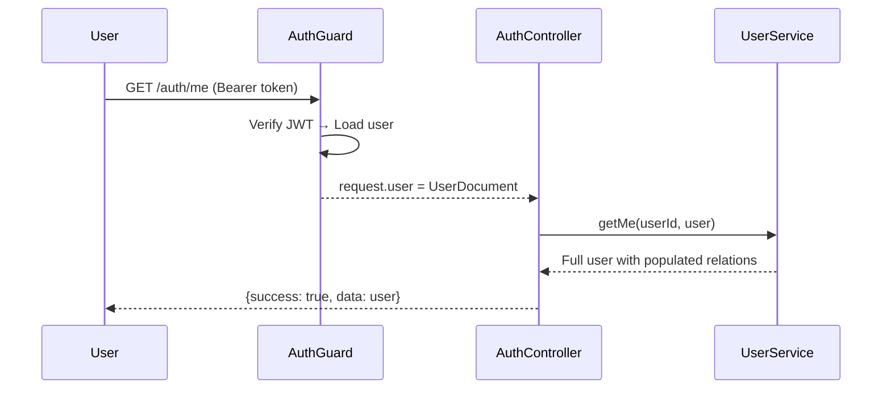

# Authentication & Authorization — Printsel

Tài liệu mô tả hệ thống xác thực (Authentication) và phân quyền (Authorization) của Printsel.

---

## 1. Tổng quan

```
┌──────────────────────────────────────────────────────────┐
│                   Auth Architecture                       │
│                                                           │
│  ┌─────────────┐  ┌────────────┐  ┌───────────────────┐  │
│  │  Passport   │  │   JWT      │  │   Redis           │  │
│  │  Strategies │  │  RS256     │  │   Token Store     │  │
│  │  jwt,public │  │  Signing   │  │   Session Mgmt    │  │
│  └──────┬──────┘  └─────┬──────┘  └────────┬──────────┘  │
│         │               │                   │             │
│         ▼               ▼                   ▼             │
│  ┌──────────────────────────────────────────────────────┐ │
│  │              @Auth() Decorator                        │ │
│  │  Composes: AuthGuard + RateLimiter + Permissions     │ │
│  │             + Roles + Swagger + Interceptor           │ │
│  └──────────────────────────────────────────────────────┘ │
│                          │                                │
│         ┌────────────────┼────────────────┐               │
│         ▼                ▼                ▼               │
│  ┌────────────┐  ┌─────────────┐  ┌──────────────┐      │
│  │ RolesGuard │  │ Permissions │  │ RateLimiter  │      │
│  │            │  │ Guard       │  │ Guard        │      │
│  └────────────┘  └─────────────┘  └──────────────┘      │
└──────────────────────────────────────────────────────────┘
```

---

## 2. Authentication (Xác thực)

### 2.1 JWT Configuration

| Setting | Giá trị | Mô tả |
|---------|---------|-------|
| **Algorithm** | RS256 (RSA) | Asymmetric signing — private key sign, public key verify |
| **Private Key** | `JWT_PRIVATE_KEY` (env) | PEM format RSA private key |
| **Public Key** | `JWT_PUBLIC_KEY` (env) | PEM format RSA public key |
| **Expiration** | `JWT_EXPIRATION_TIME` (env) | Default: 86400 seconds (24 giờ) |

### 2.2 JWT Payload

```typescript
{
  sessionId: string,   // Unique session ID (nanoid)
  userId: string,      // MongoDB _id of user
  type: 'ACCESS_TOKEN',
  role: RoleType,      // System role name (e.g., 'Admin', 'Seller')
}
```

### 2.3 Login Flow



### 2.4 Token Storage in Redis

Tokens được lưu trong Redis với key pattern:

```
token:{sessionId}:{userId}
```

Mục đích:
- **Session management** — Cho phép deactivate sessions riêng lẻ
- **Token invalidation** — Logout xóa token khỏi Redis
- **Multi-device support** — Mỗi login tạo sessionId mới

### 2.5 Passport Strategies

| Strategy | Class | Mục đích |
|----------|-------|---------|
| **jwt** | `JwtStrategy` | Strategy chính — extract token từ `Authorization: Bearer` header, verify signature, load user |
| **public** | `PublicStrategy` | Cho phép request không có token đi qua — user = `{ [Symbol.for('isPublic')]: true }` |

#### JwtStrategy.validate()

```
Extract token → Verify RS256 signature → Decode payload
    → Check type === ACCESS_TOKEN
    → role === RoleType.Customer?
        YES → CustomerService.getById(userId) (collection `customers`, KHÔNG phải `users`)
              → gắn role ảo { name: RoleType.Customer } (CustomerEntity không có roleId)
        NO  → UserService.getUserById(userId)
    → Check status !== Inactive
    → Return user/customer (attached to request) — RolesGuard/PermissionsGuard tái dùng
      nguyên vẹn cho cả 2 vì object trả về đều có `_id` + `role.name`.
```

Token của Customer Portal dùng CHUNG cơ chế JWT/Redis session này (cùng
`AuthService.createAccessToken`), chỉ khác nguồn load user — xem
[`FunctionDescription/CustomerPortal.md`](../FunctionDescription/CustomerPortal.md).

### 2.6 Logout Flow

```
User → GET /auth/logout (with Bearer token)
    → Decode token to get sessionId
    → Redis: DELETE token:{sessionId}:{userId}
    → DB: Mark action session as inactive
```

### 2.7 Session Deactivation

Admin/Seller có thể deactivate sessions khác:

```
GET /auth/deactivate-session/:userId/:sessionId
    → Redis: DELETE token:{sessionId}:{userId}
    → DB: Update actions {userId, sessionId} → active: false
```

---

## 3. Authorization (Phân quyền)

### 3.1 Mô hình phân quyền

Hệ thống sử dụng mô hình **Role-Based Access Control (RBAC)** với 3 lớp:

```
User
 ├── roleId → RoleEntity (System Role)
 │       └── permissionIds → [PermissionEntity...]
 │
 ├── customRoleId → CustomRoleEntity (Custom Role)
 │       └── permissionIds → [PermissionEntity...]
 │
 └── otherPermissionIds → [PermissionEntity...]
         (Extra permissions cho user cụ thể)
```

### 3.2 System Roles (RoleEntity)

Roles cố định, built-in:

| Role | Mô tả | Ví dụ quyền |
|------|-------|-------------|
| `SuperAdmin` | Toàn quyền | Tất cả |
| `Admin` | Quản trị | CRUD users, roles, settings |
| `Seller` | Người bán | Tạo đơn, quản lý store, wallet |
| `Manager` | Quản lý | View báo cáo, quản lý team |
| `SellerManager` | Quản lý seller | Quản lý nhóm seller |
| `ProductManager` | Quản lý SP | CRUD products, categories |
| `SupportManager` | Quản lý support | Quản lý issues, team support |
| `Support` | Hỗ trợ | Xử lý issues, hỗ trợ seller |
| `Developer` | Dev | Truy cập kỹ thuật, cronjobs |
| `Shipment` | Vận chuyển | Quản lý tracking |
| `Provider` | Nhà cung cấp | Xem đơn liên quan |
| `Accountant` | Kế toán | Quản lý transactions |
| `Designer` | Thiết kế | Quản lý artworks |
| `Logistics` | Logistics | Ship out, manifest, tracking |
| `Fulfillment` | Fulfillment | Đóng gói, giao hàng |
| `Referrer` | Giới thiệu | Xem commission |

**Entity:** `RoleEntity` trong collection `roles`:

| Field | Type | Mô tả |
|-------|------|-------|
| `name` | `RoleType` (enum) | Tên role — unique |
| `description` | string | Mô tả |
| `permissionIds` | string[] | Danh sách permission IDs |
| `status` | Status | Active / Inactive |

### 3.3 Custom Roles (CustomRoleEntity)

Admin có thể tạo roles tùy chỉnh:

| Field | Type | Mô tả |
|-------|------|-------|
| `name` | string (unique) | Tên role tùy chỉnh |
| `description` | string | Mô tả |
| `permissionIds` | string[] | Danh sách permission IDs |
| `status` | Status | Active / Inactive |

Custom roles cho phép linh hoạt tạo vai trò mới mà không cần thay đổi code.

### 3.4 Permission System

**PermissionEntity** (collection `permissions`) định nghĩa các quyền granular:

```typescript
enum PermissionType {
  ViewProduct = 0,
  EditProduct = 1,
  CreateProduct = 2,
  ViewTracking = 3,
  CreateTracking = 4,
  EditTracking = 5,
}
```

User có permissions từ 3 nguồn:
1. **System Role** → `role.permissionIds`
2. **Custom Role** → `customRole.permissionIds`
3. **Other Permissions** → `user.otherPermissionIds`

### 3.5 User Entity (Auth-related fields)

| Field | Type | Mô tả |
|-------|------|-------|
| `email` | string (unique) | Email đăng nhập |
| `password` | string (hashed) | Bcrypt hash |
| `roleId` | string (ref: RoleEntity) | System role ID |
| `customRoleId` | string (ref: CustomRoleEntity) | Custom role ID (optional) |
| `otherPermissionIds` | string[] | Extra permission IDs |
| `status` | Status | Active / Inactive / Pending |
| `tier` | Tier | Standard / Silver / Gold / Diamond |
| `telegramConfig` | object | Telegram notification settings |
| `debtLimit` | number | Credit limit |

**Virtual populates:**
- `role` → populate `RoleEntity` from `roleId`
- `customRole` → populate `CustomRoleEntity` from `customRoleId`

---

## 4. `@Auth()` Decorator

Central decorator kết hợp tất cả guards và metadata:

### Definition

```typescript
// apps/api/src/decorators/http.decorator.ts
function Auth(
  roles: RoleType[] = [],
  permission: PermissionType[] = [],
  options?: { public: boolean }
): MethodDecorator
```

### Composition

`@Auth()` apply các decorators sau theo thứ tự:

```
@Auth([RoleType.Admin], [PermissionType.EditProduct])
    │
    ├── SetMetadata('roles', [RoleType.Admin])
    ├── SetMetadata('permission', [PermissionType.EditProduct])
    ├── UseGuards(
    │       AuthGuard({public: false}),  ← JWT verification
    │       RateLimiterGuard,            ← Rate limiting
    │       PermissionsGuard,            ← Check permission metadata
    │       RolesGuard                   ← Check role metadata
    │   )
    ├── ApiBearerAuth()                  ← Swagger: require Bearer token
    ├── UseInterceptors(AuthUserInterceptor)  ← Attach user to request
    └── PublicRoute(false)               ← Mark as non-public
```

### Guard Execution Order

```
Request
 │
 ▼
AuthGuard (Passport JWT)
 │ → Verify JWT token
 │ → Load user from DB
 │ → Attach user to request
 ▼
RateLimiterGuard
 │ → Check rate limit (Redis-based)
 ▼
PermissionsGuard
 │ → Read 'permission' metadata
 │ → Check user has required permissions
 ▼
RolesGuard
 │ → Read 'roles' metadata
 │ → Check user.role.name is in allowed roles
 │ → Empty roles array = any authenticated user
 ▼
Controller Method
```

### Usage Patterns

```typescript
// Any authenticated user
@Auth()

// Specific roles only
@Auth([RoleType.Admin, RoleType.Seller])

// Roles + specific permission
@Auth([RoleType.Admin, RoleType.Logistics], [PermissionType.CreateTracking])

// Public endpoint (no auth required, but user is populated if token exists)
@Auth([], [], { public: true })
```

---

## 5. Rate Limiting

- **Service:** `RateLimiterService` (trong `SharedModule`)
- **Guard:** `RateLimiterGuard` (applied via `@Auth()`)
- **Backend:** Redis-based
- **Config:** `RATE_LIMITER_*` env variables

---

## 6. Security Considerations

### Implemented

| Feature | Implementation |
|---------|---------------|
| Password hashing | Bcrypt (via `core/utils`) |
| JWT asymmetric signing | RS256 (RSA key pair) |
| Token storage | Redis with TTL |
| Session management | Per-device sessions via sessionId |
| Rate limiting | Redis-based per-user/IP |
| Role-based access | Multi-layer RBAC |
| Input validation | Zod DTOs on all endpoints |
| Master password | Emergency access (env-configured) |

### Notes

- **reCAPTCHA** verification code exists nhưng đang **commented out**.
- **Refresh token** logic exists nhưng đang **commented out** — hiện chỉ dùng access token.
- **Master password** cho phép login bất kỳ account nào — chỉ nên dùng trong emergency.
- **Password validation** pattern: 12-32 chars, uppercase + lowercase + digit + special char.
- **User inactive check** — inactive users bị block ở cả JWT validation (strategy) và login (service).

---

## 7. Auth Flow Diagrams

### Registration



### Get Current User



---

## Tài liệu liên quan

- [Glossary](../Foundation/Glossary.md) — Danh sách Roles, Tiers, Permissions
- [C4 Model](./C4_Model.md) — Architecture overview
- [Infrastructure](./Infrastructure.md) — Redis, JWT env variables
