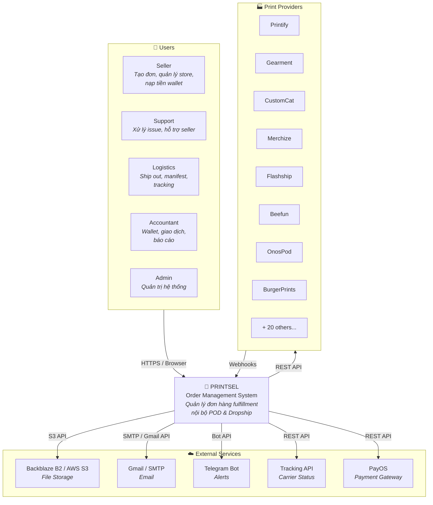
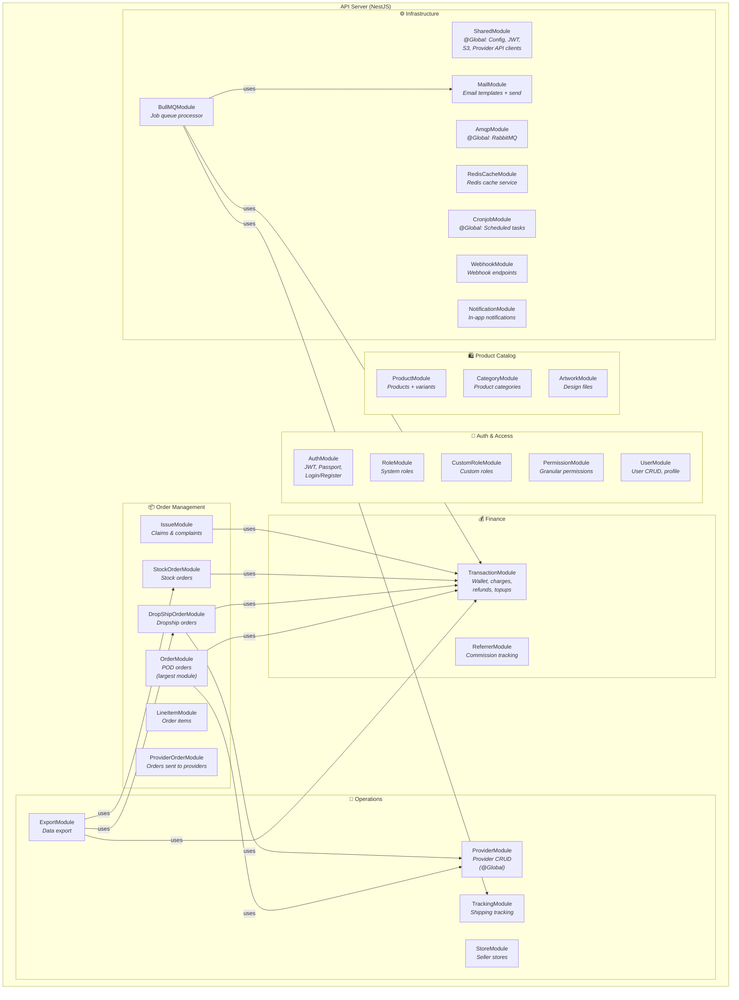

# C4 Model — Printsel Architecture

Tài liệu mô tả kiến trúc hệ thống Printsel theo mô hình [C4](https://c4model.com/) — từ tổng quan (Context) đến chi tiết bên trong (Component).

> Diagrams sử dụng Mermaid syntax — render được trên GitHub, GitLab, và hầu hết Markdown viewers.

---

## Level 1 — System Context

Mô tả Printsel tương tác với ai và hệ thống nào bên ngoài.



### Mô tả quan hệ

| Từ | Đến | Protocol | Mô tả |
|---|---|---|---|
| Users | Printsel | HTTPS (Browser) | Truy cập Web App qua browser |
| Printsel | Print Providers | REST API | Gửi đơn, lấy trạng thái, lấy tracking |
| Print Providers | Printsel | Webhooks (HTTP POST) | Callback khi trạng thái đơn thay đổi |
| Printsel | Backblaze/S3 | S3 API | Upload/download artwork, mockup, label, export files |
| Printsel | Gmail/SMTP | SMTP/API | Gửi email thông báo, scheduled emails |
| Printsel | Telegram | Bot API | Alert khi có lỗi critical, order summary |
| Printsel | Tracking API | REST | Fetch trạng thái vận chuyển từ carrier |
| Printsel | PayOS | REST | Payment processing (optional) |

---

## Level 2 — Container Diagram

Mô tả các "container" (ứng dụng, database, message broker...) bên trong hệ thống Printsel.

```mermaid
graph TB
    Browser["🌐 Browser<br/><i>User's Web Browser</i>"]

    subgraph PrintselSystem["PRINTSEL SYSTEM"]
        WebApp["📱 Web App<br/><b>React + Vite + Ant Design</b><br/><i>SPA Admin Panel</i><br/>Port: varies"]

        API["⚙️ API Server<br/><b>NestJS + Fastify</b><br/><i>REST API + Microservice</i><br/>Port: 3007"]

        MongoDB["🗄️ MongoDB<br/><i>Primary Database</i><br/><i>Document store cho<br/>orders, products, users...</i>"]

        Redis["⚡ Redis<br/><i>Cache + Queue Backend</i><br/><i>Session tokens, cache,<br/>BullMQ backing store</i>"]

        RabbitMQ["🐰 RabbitMQ<br/><i>Message Broker</i><br/><i>Async events: order updates,<br/>export, email, webhooks</i>"]

        BullMQ["📋 BullMQ<br/><i>Job Queue (on Redis)</i><br/><i>Scheduled jobs: tracking refresh,<br/>email scan, mail send</i>"]

        ELK["📊 Elasticsearch + Kibana<br/><i>Optional: Logging & Search</i>"]
    end

    ExternalProviders["🏭 Print Providers<br/><i>Printify, Gearment,<br/>CustomCat, Merchize...</i>"]
    Storage["☁️ Backblaze B2 / S3<br/><i>Object Storage</i>"]

    Browser -->|HTTPS| WebApp
    WebApp -->|REST API calls| API
    API -->|Mongoose| MongoDB
    API -->|cache-manager-redis-yet| Redis
    API -->|@golevelup/nestjs-rabbitmq| RabbitMQ
    API -->|@nestjs/bullmq| BullMQ
    BullMQ -.->|backed by| Redis
    API -->|REST + Webhooks| ExternalProviders
    API -->|S3 presigned URLs| Storage
    API -.->|Winston + Filebeat| ELK
```

### Container Details

| Container | Tech Stack | Vai trò | Deployment |
|-----------|-----------|---------|------------|
| **Web App** | React 18, Vite 4, TypeScript, Ant Design, Zustand, Tailwind | SPA admin panel — UI cho tất cả actors | Docker / Static hosting |
| **API Server** | NestJS 10, Fastify, Mongoose, Passport JWT, Zod, Swagger | REST API + background processors + RabbitMQ consumers | PM2 / Docker |
| **MongoDB** | MongoDB (cloud/self-hosted) | Primary data store — orders, products, users, transactions... | Managed / Self-hosted |
| **Redis** | Redis Alpine | Cache layer + BullMQ job queue backing store + session tokens | Docker Compose |
| **RabbitMQ** | RabbitMQ 3 (management) | Message broker — async event processing | Docker Compose |
| **BullMQ** | BullMQ (runs inside API process) | Scheduled repeatable jobs — tracking refresh, email scan | Same process as API |
| **Elasticsearch + Kibana** | ELK 8.7.1 | Optional — logging, search, monitoring dashboard | Docker Compose (separate) |

---

## Level 3 — Component Diagram (API Server)

Chi tiết các module/component bên trong API Server và cách chúng giao tiếp.



### Module Dependencies (key relationships)

| Module | Depends On | Reason |
|--------|-----------|--------|
| **OrderModule** | TransactionModule, ProviderModule, UploadModule, UserModule | Charge wallet khi xử lý đơn; gửi đơn cho provider |
| **DropShipOrderModule** | TransactionModule, ProviderModule, UserModule, CounterModule | Tương tự Order nhưng cho dropship flow |
| **StockOrderModule** | TransactionModule, ProviderModule, UserModule | Tương tự cho stock flow |
| **TransactionModule** | DropShipOrderModule (forwardRef) | Circular dependency: transaction cần đọc dropship orders cho refund |
| **IssueModule** | TransactionModule, nhiều order/line item modules | Issue cần truy cập data đơn hàng và thực hiện refund |
| **ExportModule** | TransactionModule, DropShipOrderModule, StockOrderModule | Export cần query data từ nhiều nguồn |
| **BullMQModule** | TrackingModule, TransactionModule, MailModule | Job processor xử lý tracking refresh, email scan, mail send |
| **SharedModule** (@Global) | — | Cung cấp config, provider API clients, S3, JWT cho toàn bộ app |

### Circular Dependencies

Hệ thống có một số circular dependencies xử lý bằng `forwardRef()`:

- `TransactionModule` ↔ `DropShipOrderModule` — Transaction cần biết đơn dropship để hoàn tiền, Dropship cần Transaction để charge.
- `AuthModule` ↔ `UserModule` — Auth cần User để validate, User cần Auth để create tokens.

---

## Communication Patterns

### Synchronous (Request-Response)

```
Browser → Web App → API Server → MongoDB
                              → Redis (cache)
                              → Provider APIs (HTTP)
```

### Asynchronous (Event-Driven)

```
API Server → RabbitMQ → Consumers (trong cùng API process)
           → BullMQ → Processor (trong cùng API process)
```

Chi tiết về event-driven architecture xem: [Event-Driven Architecture](./Event_Driven.md)

---

## Tài liệu liên quan

- [System Overview](../Foundation/System_Overview.md) — Tổng quan nghiệp vụ
- [Infrastructure & Deployment](./Infrastructure.md) — Chi tiết infrastructure
- [Event-Driven Architecture](./Event_Driven.md) — RabbitMQ + BullMQ
- [Auth System](./Auth_System.md) — Authentication & Authorization
