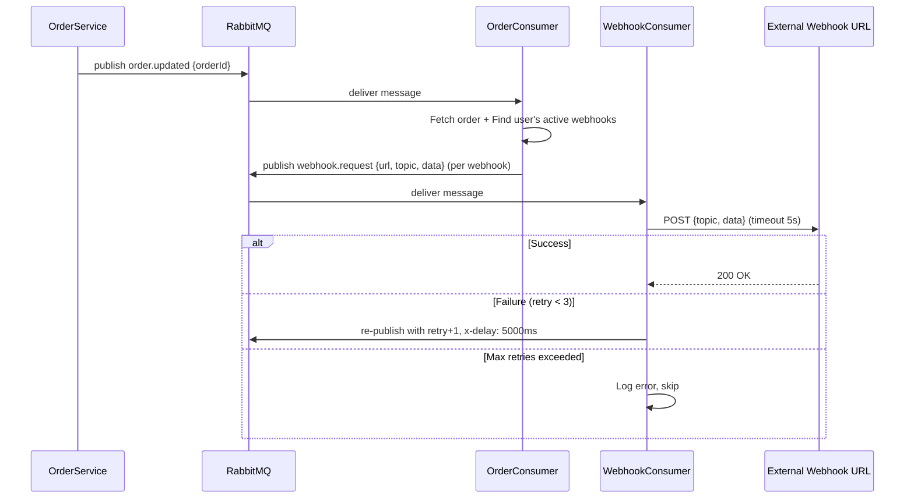
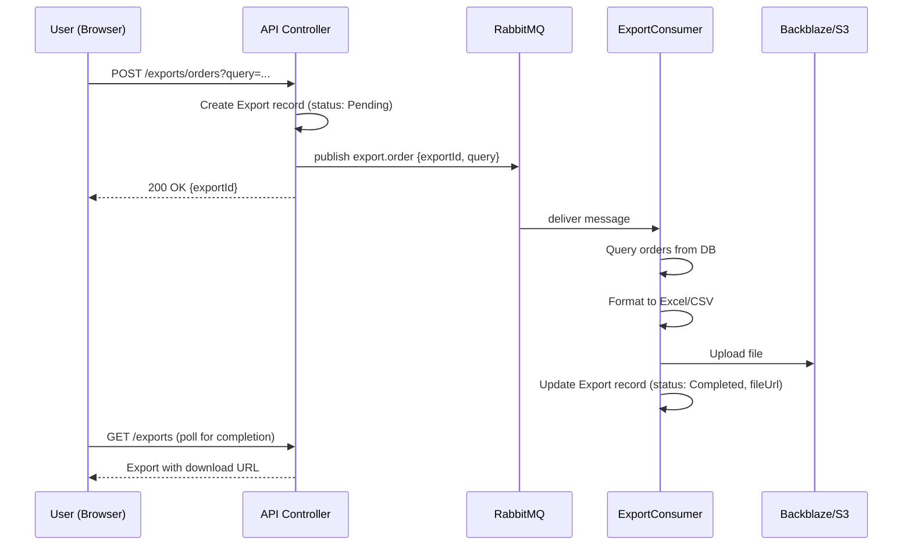
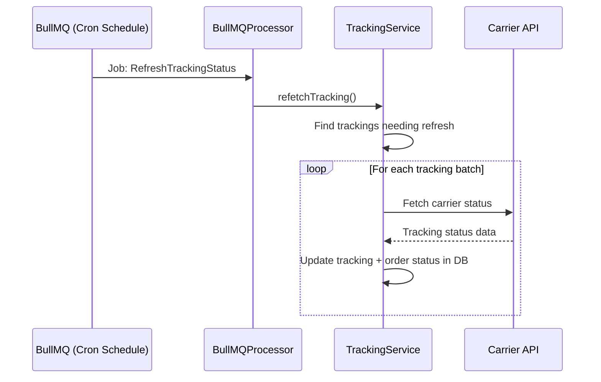

# Event-Driven Architecture — Printsel

Tài liệu mô tả hệ thống messaging bất đồng bộ: **RabbitMQ** (message broker) và **BullMQ** (job queue).

---

## 1. Tổng quan

Printsel sử dụng hai cơ chế xử lý bất đồng bộ:

| Cơ chế | Công nghệ | Mục đích | Backing Store |
|--------|-----------|---------|--------------|
| **Message Broker** | RabbitMQ (`@golevelup/nestjs-rabbitmq`) | Event-driven communication giữa modules: order updates, webhooks, export, email, notifications | RabbitMQ server |
| **Job Queue** | BullMQ (`@nestjs/bullmq`) | Scheduled repeatable jobs: tracking refresh, email scan, mail send | Redis |

```
┌─────────────────────────────────────────────┐
│               API Server                     │
│                                              │
│  ┌──────────┐        ┌───────────────────┐  │
│  │ Services │──pub──→│    RabbitMQ       │  │
│  │          │        │  (Direct Exchange) │  │
│  └──────────┘        └────────┬──────────┘  │
│                               │              │
│                        ┌──────┴──────┐       │
│                        ▼             ▼       │
│                 ┌──────────┐  ┌──────────┐  │
│                 │Consumers │  │  DLQ     │  │
│                 │(in-proc) │  │(retries) │  │
│                 └──────────┘  └──────────┘  │
│                                              │
│  ┌──────────┐        ┌───────────────────┐  │
│  │ BullMQ   │──jobs──│     Redis         │  │
│  │ Service  │        │  (Queue Backend)  │  │
│  └──────────┘        └────────┬──────────┘  │
│                               │              │
│                        ┌──────┴──────┐       │
│                        ▼             │       │
│                 ┌──────────┐         │       │
│                 │Processor │         │       │
│                 │(in-proc) │         │       │
│                 └──────────┘         │       │
└──────────────────────────────────────────────┘
```

---

## 2. RabbitMQ

### 2.1 Configuration

- **Module:** `AmqpModule` (`apps/api/src/modules/amqp/amqp.module.ts`) — `@Global()`
- **Library:** `@golevelup/nestjs-rabbitmq`
- **Exchange:** 1 direct exchange, tên lấy từ env `RABBITMQ_MAIN_EXCHANGE`
- **Connection:** `RABBITMQ_URI` (AMQP protocol)
- **Heartbeat:** 15 seconds
- **Reconnect:** 30 seconds

### 2.2 Exchange & Queues

Hệ thống sử dụng **1 direct exchange** với nhiều routing keys. Mỗi routing key map tới 1 queue:

| Routing Key | Queue | Consumer | Module |
|---|---|---|---|
| `{exchange}.order.updated` | `{exchange}.order` | `OrderConsumer` | `order` |
| `{exchange}.webhook.request` | `{exchange}.webhook` | `WebhookConsumer` | `webhooks` |
| `{exchange}.message.telegram` | `{exchange}.message` | `NotificationConsumer` | `user` |
| `{exchange}.auth.location` | `{exchange}.auth.location` | `AuthConsumer` | `auth` |
| `{exchange}.transaction.process` | `{exchange}.transaction.process` | `TransactionConsumer` | `transaction` |
| `{exchange}.mail.payment` | `{exchange}.mail` | `MailConsumer` | `mail` |
| `{exchange}.mail.send` | `{exchange}.mail.send` | `MailConsumer` | `mail` |
| `{exchange}.export.order` | `{exchange}.export.order` | `ExportConsumer` | `export` |
| `{exchange}.export.dropship-order` | `{exchange}.export.dropship-order` | `ExportConsumer` | `export` |
| `{exchange}.export.stock-order` | `{exchange}.export.stock-order` | `ExportConsumer` | `export` |
| `{exchange}.export.payment` | `{exchange}.export.payment` | `ExportConsumer` | `export` |
| `{exchange}.export.topup` | `{exchange}.export.topup` | `ExportConsumer` | `export` |
| `{exchange}.export.tracking` | `{exchange}.export.tracking` | `ExportConsumer` | `export` |

> `{exchange}` = giá trị của env `RABBITMQ_MAIN_EXCHANGE`

### 2.3 Dead Letter Queues (DLQ)

Một số consumer có DLQ cho retry mechanism:

| DLQ Queue | Source |
|---|---|
| `{exchange}.transaction.process.dlq` | TransactionConsumer |
| `{exchange}.mail.payment.dlq` | MailConsumer |
| `{exchange}.mail.send.dlq` | MailConsumer |

### 2.4 Consumer Details

#### OrderConsumer

**Trigger:** Khi order được cập nhật
**Action:** Tìm webhooks active của user → publish webhook requests qua RabbitMQ

```
Order Updated → OrderConsumer
    │
    ├── Fetch order from DB
    ├── Find active webhooks for user
    └── Publish to {exchange}.webhook.request (per webhook)
```

#### WebhookConsumer

**Trigger:** Webhook request cần gửi
**Action:** Gọi HTTP POST tới URL webhook của user. Retry tối đa 3 lần với delay 5s.

```
Webhook Request → WebhookConsumer
    │
    ├── POST data to webhook URL (timeout 5s)
    ├── Success → Done
    └── Failure → Retry (max 3) with x-delay: 5000ms
```

#### NotificationConsumer

**Trigger:** Cần gửi Telegram notification
**Action:** Gọi UserService.sendNotification() để gửi message qua Telegram Bot.

#### AuthConsumer

**Trigger:** User login
**Action:** Extract IP location (geo lookup) và cập nhật vào Action record.

#### TransactionConsumer

**Trigger:** Transaction cần xử lý (charge, refund...)
**Action:** Xử lý transaction logic. Gated bởi `ProdRabbitSubscribe` (chỉ chạy ở production).

#### MailConsumer

**Trigger:** Cần gửi email (payment notification, custom email)
**Action:** Render email template và gửi qua SMTP. Gated bởi `ProdRabbitSubscribe`.

#### ExportConsumer

**Trigger:** User yêu cầu export data
**Action:** Query data, format Excel/CSV, upload file lên S3. Có 6 handlers cho 6 loại export:
- Export Orders (POD)
- Export Dropship Orders
- Export Stock Orders
- Export Payments
- Export Topups
- Export Trackings

### 2.5 Publishing Pattern

Các service publish message qua `AmqpConnection.publish()`:

```typescript
await this.amqpConnection.publish(
  process.env.RABBITMQ_MAIN_EXCHANGE!,
  process.env.RABBITMQ_MAIN_EXCHANGE + '.order.updated',
  { orderId: order._id }
);
```

### 2.6 ProdRabbitSubscribe

Một số consumer nhạy cảm (Transaction, Mail) sử dụng `ProdRabbitSubscribe` — custom decorator chỉ enable subscriber ở production environment. Tránh xử lý transaction/email ở dev.

---

## 3. BullMQ

### 3.1 Configuration

- **Module:** `BullMQModule` (`apps/api/src/modules/queue/bullmq.module.ts`)
- **Library:** `@nestjs/bullmq`
- **Queue name:** `refresh-queue` (single queue)
- **Backend:** Redis (cùng Redis instance với cache)
- **Root config:** `BullModule.forRootAsync()` trong `app.module.ts` — connect Redis

### 3.2 Scheduled Jobs

BullMQ quản lý **3 repeatable jobs** trong queue `refresh-queue`:

| Job Name | Env Variable (Cron) | Mục đích |
|----------|---------------------|---------|
| `RefreshTrackingStatus` | `BULLMQ_REFRESH_TRACKING_STATUS_CRON_TIME` | Fetch trạng thái tracking mới nhất từ carrier APIs |
| `ScanTransactionEmail` | `BULLMQ_SCAN_TRANSACTION_EMAIL_CRON_TIME` | Scan PingPong + LianLian emails để tự động detect topup |
| `SendMail` | `BULLMQ_SEND_MAIL_CRON_TIME` | Gửi scheduled emails (email đã lên lịch sẵn) |

### 3.3 Job Flow

```
App Start → BullMQService.addRepeatableJobs()
    │
    ├── Get existing repeatable jobs from queue
    ├── Compare with configured jobs
    │   ├── New job? → Add to queue with cron pattern
    │   ├── Changed cron? → Remove old, add new
    │   ├── No cron time? → Remove job
    │   └── Orphaned job? → Remove
    │
    └── Jobs run on schedule:
        │
        ▼
    BullMQProcessor.process(job)
        │
        ├── RefreshTrackingStatus → trackingService.refetchTracking()
        ├── ScanTransactionEmail  → transactionService.scanPingPongEmail()
        │                          transactionService.scanLianLianEmail()
        └── SendMail              → mailService.sendScheduleMails()
```

### 3.4 Processor

`BullMQProcessor` (`apps/api/src/modules/queue/bullmq.processor.ts`):
- Extends `WorkerHost` (BullMQ native)
- `@Processor('refresh-queue')` decorator
- Routes job by `job.name` to appropriate service method

### 3.5 Dependencies

BullMQModule imports:
- `TrackingService` + `TrackingRepository` — cho RefreshTrackingStatus
- `TransactionModule` — cho ScanTransactionEmail
- `MailModule` — cho SendMail
- `UploadService` + Image repositories — cho file operations during tracking
- `ProviderRepository`, `DepartmentRepository` — supporting data

---

## 4. Cronjob System

Ngoài BullMQ, hệ thống còn có **CronjobModule** — quản lý dynamic cron jobs qua database.

### 4.1 Cách hoạt động

```
Database (cronjobs collection)
    │
    ▼ On App Start
CronjobRunnerService.onModuleInit()
    │
    ├── Fetch all active cronjobs from DB
    ├── For each: set cron time + start via SchedulerRegistry
    └── Jobs run according to their duration (cron pattern)
```

### 4.2 Cronjob Entity

| Field | Type | Mô tả |
|-------|------|-------|
| `name` | string | Tên hiển thị |
| `code` | string (unique) | Mã cronjob — match với SchedulerRegistry |
| `description` | string | Mô tả |
| `duration` | string | Cron pattern (e.g., `0 */5 * * *`) |
| `status` | Status | `Active` / `Inactive` |

### 4.3 CRUD API

Cronjobs được quản lý qua REST API (`/cronjobs`), chỉ Admin và Developer có quyền:
- `GET /cronjobs` — List all
- `POST /cronjobs` — Create new (tự động register với SchedulerRegistry)
- `PATCH /cronjobs/:id` — Update (tự động re-schedule)
- `DELETE /cronjobs/:id` — Delete (stop job)

### 4.4 Built-in Jobs

| Job Code | Cron | Mô tả | Status |
|----------|------|-------|--------|
| `TEST-CRON` | `0 0 5 31 2 *` (never runs) | Test job | Active in code |
| `TELEGRAM-NOTIFICATIONS` | `0 0 5 31 2 *` (never runs) | Daily order summary via Telegram | **Commented out** in module |

> Hầu hết scheduled jobs thực tế chạy qua **BullMQ**, không qua CronjobModule. CronjobModule thiên về dynamic jobs có thể CRUD từ admin UI.

---

## 5. Message Flow Diagrams

### 5.1 Order Update → Webhook Notification



### 5.2 Export Flow



### 5.3 Tracking Refresh (BullMQ)



---

## 6. Error Handling & Retry

### RabbitMQ

| Consumer | Retry Strategy |
|----------|---------------|
| WebhookConsumer | Max 3 retries, 5s delay (`x-delay` header) |
| TransactionConsumer | DLQ (`*.transaction.process.dlq`) |
| MailConsumer (payment) | DLQ (`*.mail.payment.dlq`) |
| MailConsumer (send) | DLQ (`*.mail.send.dlq`) |
| ExportConsumer | No explicit retry — errors logged |

### BullMQ

BullMQ jobs chạy theo cron schedule. Nếu job fail:
- Job sẽ chạy lại ở lần schedule tiếp theo
- Không có explicit retry config cho repeatable jobs

---

## Tài liệu liên quan

- [C4 Model](./C4_Model.md) — Architecture diagrams
- [Infrastructure](./Infrastructure.md) — Docker, PM2, env variables
- [Glossary](../Foundation/Glossary.md) — Thuật ngữ nghiệp vụ
