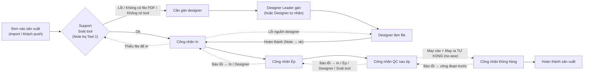

# Hướng dẫn quy trình DTF theo vai — Kịch bản ảnh (TASK-02)

> **Để làm gì:** kịch bản chụp ảnh cho trang nội bộ `/ffm/guide/dtf` (agent sau dựng trang). Mỗi bước = 1 ảnh chụp THẬT
> giao diện `apps/web` trên DỮ LIỆU DEMO, kèm chú thích `boxPct` (khuôn `OrderGuide.md` §3).
> **Chỉ mô tả hành vi đã kiểm trong code ngày 11/09/2026** (dẫn file ở mỗi mục). Chỗ nào cần USER quyết định ghi ở §2.
> **Script:** `apps/web/scripts/dtf-guide/seed-demo.mjs` (dữ liệu demo) · `apps/web/scripts/dtf-guide/capture.mjs` (chụp).
> **Ảnh:** `apps/web/public/guide/dtf/<vai>/<bước>.webp` + `apps/web/public/guide/dtf/manifest.json`.

---

## 1. Đối chiếu cấu hình xưởng DTF (Việc 1)

### 1.1 Nguồn số liệu — ĐỌC KỸ

- **Agent API production KHÔNG gọi được**: `CheckProductionData.md` §2 chỉ khoá prod về file
  `~/.claude/projects/d--Onos/memory/onosfactory-prod-agent-api.md` — thư mục memory đó **trống** trên máy này.
  Không tự đi tìm khoá ở nơi khác. → **Cần người vận hành cấp khoá** để kiểm lại trên production.
- Số dưới đây đọc **chỉ đọc** (mongosh `find`/`aggregate`) từ DB local `onosfactory` — bản sao production.
  Độ mới: đơn mới nhất toàn hệ thống `2026-09-11 05:28 UTC`, đơn MLDTF mới nhất `inProductionAt 2026-08-27`.
  Có thể lệch production; **phải kiểm lại bằng Agent API trước khi chốt nội dung trang**.
- **DEV-11 (11/09/2026):** số trong §1 chỉ dùng để lên kịch bản — KHÔNG đưa lên trang. Chữ trên trang hướng dẫn cách kiểm, danh sách
  "cần kiểm khi triển khai" ở `DtfRoleGuide.md` §2.5.

### 1.2 Kết quả

| Hạng mục | Giá trị (DB local) | Hệ quả cho hướng dẫn |
| --- | --- | --- |
| Xưởng | `shortName=MLDTF`, `name="DTF Mê Linh"`, `isActive=true` | — |
| `flowType` | `no-sew` | QC sau ép xong → May vào + May ra **tự Done** → đơn chờ ở Đóng hàng (`packages/shared/enums/factory-flow.ts:33-37`) |
| `autoCompletePack` | **không có field** (= `false`) | Đóng hàng phải **xác nhận tay** → vai Đóng hàng có tồn tại về quy trình |
| Công nhân Fulfillment của MLDTF (đếm theo `fulfillmentStage`, Active) | `print` = 1 · `press` = 1 · **`qc-post-press` = 0 · `pack` = 0** | Hiện KHÔNG có ai giữ QC sau ép và Đóng hàng (xem §2 Q1) |
| Đơn MLDTF (301 đơn, không hủy) | 279 đơn đứng ở **Ép – Đang chờ** (In đã xong) · 1 đơn In – Đang chờ · 21 đơn đã hoàn thành | 20/21 đơn hoàn thành đi qua **"Chuyển hoàn thành" của SuperAdmin** (timeline `reason='Chuyển hoàn thành'`, orderLog `force_complete`), không qua QC/Đóng hàng thật |
| Sản phẩm `printMethod='dtf'` gắn MLDTF | **1**: `Camo Shirt` (shortName `CAMO SHIRT`, dòng `2d`, máy "In và ép nhiệt", vị trí in front/back/chestLeft, size S–5XL, `designReviewCode=TIFF`) | Demo dùng "DEMO DTF Camo Shirt". DTF chỉ có ở MLDTF |
| Designer auto-assign cho MLDTF | **Không** — mức 3 chỉ cấu hình 2 xưởng khác; mức 1 (khách) và mức 2 (sản phẩm) rỗng | Đơn MLDTF soát lỗi **không tự gán**, nằm ở "Cần gán designer" chờ Leader gán / Designer tự nhận |
| Đơn MLDTF theo designer | 151 đơn `designerStatus=done`, 129 `unassigned` + `toolResultNote=ok` | Phần lớn đơn soát OK đi thẳng In, không qua designer |

**Danh mục lỗi công đoạn** (`workshopConfigs`, `category=production_error`, có `stage`) — **dùng chung MỌI xưởng**
(không có `factoryId`, `StageErrorCatalog.md` §3):

| Công đoạn | Lỗi đang bật | Đích đẩy về |
| --- | --- | --- |
| In | **0** (1 lỗi đã ẩn) | — công nhân In không báo lỗi bằng mã quét `E-` được, phải chọn ô "Lỗi xưởng" |
| Ép | 3: "lỗi bẩn vải" → In · "loi thiet ke" → Designer · "QA loi ep thu nghiem" → In | Tên thứ 3 là dữ liệu thử |
| QC sau ép | 33 (4 đã ẩn): 7 lỗi → Soát tool ("tui", "thân sau", "bù cả lỗi tool", "ko khớp", "ko khớp tay", "sai áo"…), 26 lỗi → Designer ("túi", "lỗi thân sau", "ko đối tay", "lỗi cổ", "sai tay", "lỗi trụ", "lỗi mũ", "sai canh vải"…) | Nhiều tên trùng nghĩa/không dấu — xem §2 Q4 |
| Đóng hàng | **0** | — |

Lỗi chung (không `stage`, dùng ở ô "Lỗi xưởng"/dialog): Sai size · Sai màu · Sai loại vải · In lệch · In mờ/nhòe ·
Vải lỗi/rách · Máy lỗi/kẹt · Lỗi khác (nguồn xưởng) · Sai design · Thiếu file design (nguồn designer) · Thiếu file để in (nguồn soát tool).

### 1.3 Vai nào thực sự có người

| Vai | Có trong quy trình? | Có người thật ở MLDTF? |
| --- | --- | --- |
| Support soát tool | Có (không gắn xưởng) | 2 tài khoản Support toàn hệ thống |
| Designer Leader + Designer | Có (không gắn xưởng) | 1 Leader, 6 Designer toàn hệ thống |
| Công nhân In | Có | **Có** (1) |
| Công nhân Ép | Có | **Có** (1) |
| Công nhân QC sau ép | Có — `no-sew` vẫn giữ QC | **Không** |
| Công nhân Đóng hàng | Có — `autoCompletePack=false` | **Không** |
| Quản lý xưởng / Admin | Có | 1 Manager, 4 SuperAdmin toàn hệ thống |

---

## 2. Quyết định USER (chốt 11/09/2026) + câu hỏi ban đầu

### 2.1 USER đã chốt

| # | Quyết định | Hệ quả trong kịch bản / script |
| --- | --- | --- |
| D1 | Trang NỘI BỘ sau đăng nhập ở `/ffm` (agent sau dựng) | — |
| D2 | Ảnh CHỤP THẬT `apps/web` trên DỮ LIỆU DEMO, không chụp dữ liệu thật | §4.1 che dữ liệu, §6 seed |
| D3 | Đủ vai: Support · Designer Leader · Designer · công nhân In / Ép / QC sau ép / Đóng hàng · Quản lý | §5.1–§5.8 |
| D4 | **QC sau ép + Đóng hàng VẪN HƯỚNG DẪN ĐỦ** (trả lời Q1/Q2) | Seed chạy `--stages print,press,qc-post-press,pack` → có `demo.qc@` + `demo.donghang@`. Phần Quản lý (§5.8) hướng dẫn **kiểm** mọi công đoạn đã có người giữ khi triển khai — Admin/Manager không thao tác thay được trên kanban (A1). **DEV-11:** trang KHÔNG nêu hiện trạng người giữ của xưởng thật (§1 là số DB local, không kiểm được trên production) |
| D5 | **Phần Quản lý viết theo quyền Admin** (trả lời Q3) | Seed tạo `demo.admin@example.com` vai **Admin** (bỏ Manager demo). KHÔNG dùng `admin@local.dev` để chụp |
| D6 | **Danh mục lỗi: tạo vài lỗi DEMO** gọn, có dấu, có đích đẩy về, chỉ DB local, qua `POST /workshop-config/stage-errors` (thay cho Q4/Q5 — không dọn/sửa/xoá lỗi thật) | 13 lỗi DEMO (§6.1). Khi chụp danh mục lỗi / bảng barcode / dialog chọn lỗi, `capture.mjs` lọc response `workshop-config` chỉ giữ mã lỗi DEMO (`out/demo-stage-errors.json`) |
| D7 | Cho phép reset mật khẩu `admin@local.dev` bằng `bash .devtasks/dev-login.sh reset admin@local.dev`, chỉ DB localhost | Thông tin đăng nhập nằm ở `apps/web/scripts/dtf-guide/.env.local` (gitignore: `DTF_ADMIN_EMAIL`, `DTF_ADMIN_PASSWORD`, `DTF_DEMO_PASSWORD`) — hai script tự đọc, không in ra log |

### 2.2 Câu hỏi ban đầu của DEV-05 — trạng thái

Q1–Q5 đã được D4–D6 trả lời. **Q6 (auto-gán designer cho MLDTF) vẫn mở** — kịch bản Leader viết theo hiện trạng: gán tay.

| # | Câu hỏi | Vì sao |
| --- | --- | --- |
| Q1 | Có viết hướng dẫn cho **QC sau ép** và **Đóng hàng** không, khi MLDTF chưa có ai giữ 2 công đoạn này? Hay (a) tạo tài khoản thật, hoặc (b) bật `autoCompletePack` cho MLDTF (thì bỏ vai Đóng hàng)? | 279 đơn kẹt ở Ép–Đang chờ; đơn qua được QC/Đóng hàng chỉ nhờ SuperAdmin "Chuyển hoàn thành". **Quản lý KHÔNG thao tác thay được trên giao diện**: trang Task Fulfillment của Manager chỉ hiện thông báo "Tài khoản chưa được gán Stage Fulfillment" (`pages/fulfillment/my-tasks/index.tsx:745-752`), trang Quét mã của Manager chỉ mở dialog gán lỗi, không có Hoàn thành |
| Q2 | Seed demo tạo công nhân cho công đoạn nào? Mặc định `--stages print,press` (đúng MLDTF). Muốn chụp vai QC/Đóng hàng thì chạy `--stages print,press,qc-post-press,pack` | Hướng dẫn phải chụp bằng tài khoản có `fulfillmentStage` mới thấy màn làm việc |
| Q3 | Vai "Quản lý xưởng": dùng tài khoản **Manager** hay **Admin**? | Manager KHÔNG tạo được user (`POST /users` chỉ SuperAdmin/Admin), KHÔNG bấm được "Hoàn thành đơn tồn ở Đóng hàng" (`POST /fulfillment/complete-pack-backlog` chỉ Admin/SuperAdmin), KHÔNG thấy nút "Theo xưởng/Tổng" ở tab xưởng |
| Q4 | Danh mục lỗi QC sau ép có nhiều mục trùng/không dấu/thử nghiệm ("tui" vs "túi", "ko khớp" vs "không khớp", "QA loi ep thu nghiem" ở Ép). Dọn trước khi in bảng barcode dán trạm và trước khi chụp? | Ảnh trang danh mục chụp trên dữ liệu thật sẽ hiện đúng các tên này |
| Q5 | Danh mục lỗi công đoạn dùng chung mọi xưởng — thêm lỗi riêng cho DTF sẽ hiện ở cả xưởng khác. Chấp nhận? | `workshop-config` không có `factoryId` |
| Q6 | Có cấu hình auto-gán designer cho MLDTF không? | Hướng dẫn Leader khác nhau: gán tay hằng ngày vs chỉ xử lý phần sót |

---

## 3. Sơ đồ tổng quan luồng DTF liên vai (trang vẽ lại, không phải ảnh)

Ghi chú vẽ:
- Nét liền = luồng thuận; nét đứt = đẩy về khi báo lỗi. Công đoạn nhận lại đơn thấy nó ở **"Làm lại / Cần làm lại"**;
  mọi công đoạn đã làm xong mà đơn bị đẩy lùi qua đầu thấy đơn ở **"Đang chờ quay lại"** (`FulfillmentWorkflow.md` §2.3, §5.3).
- May vào / May ra vẫn hiện trên các bảng tổng quan, phễu, chip đẩy về — chỉ là tự hoàn thành (§1c của nghiên cứu, `factory-flow.ts`).
- Xuyên suốt: **Giữ đơn** khoá mọi thao tác tới khi mở lại (`Orders.md` §9b); **Quét mã** `N-<mã sản xuất>` → `OK` hoặc `E-<mã lỗi>` quét 2 lần (`StageErrorCatalog.md` §2.2).

---

## 4. Quy ước chung cho mọi ảnh

| Hạng mục | Quy ước |
| --- | --- |
| Viewport | 1440×900, `deviceScaleFactor 1`, `timezoneId Asia/Ho_Chi_Minh` (FE tính "hôm nay" theo giờ trình duyệt, BE hiểu là ngày VN) |
| Ngôn ngữ | App mặc định **tiếng Anh** (`i18n/index.ts:76`) → script đặt `localStorage['onosfactory-language']={"state":{"language":"vi"},"version":0}`; theme sáng `printera-theme` |
| Đăng nhập | Qua form `/adm/login` (ô `email`, `password`, nút "Tiếp tục"). Designer về `/ffm/my-tasks`, vai khác về `/ffm/dashboard` (`pages/login/index.tsx:77-78`). Mật khẩu lấy từ `scripts/dtf-guide/.env.local` (gitignore). API `POST /auth/login` trả phẳng `{ accessToken, user }`, không bọc `data` |
| Cuộn | Khung app cố định: **chỉ `<main>` cuộn**, sidebar/header đứng yên → `scrollIntoView` của Playwright không đưa phần tử về đúng chỗ. `capture.mjs` có `scrollMainTo()`; `shot()` tự cuộn main tới vùng clip. Vùng cuộn con (backlog "Cần gán designer" `max-h-80vh`, bảng xưởng ảo hoá) phải cuộn riêng |
| Ngày của đơn demo | Seed đặt `inProductionAt = lúc chạy seed`. Bảng In chỉ hiện **hôm nay** (`PrintOrderTable.tsx:147-148`); kanban/Designer/Soát tool mặc định **7 ngày** → chạy seed trong ngày chụp |
| Manifest | Mỗi ảnh: `{ role, step, file, width, height, screen, shows, masked[], callouts: [{ n, xPct, yPct, boxPct:{x,y,w,h}, label, detail }] }` — `boxPct` theo % vùng chụp, cộng lề 5px, cùng thuật toán `capture-order-guide.mjs` |
| Lưới mực | Ghi riêng `apps/web/scripts/dtf-guide/out/guideShots.generated.json` (JSON — KHÔNG ghi `.ts` khi API đang chạy). DEV dựng trang chuyển thành `guideShots.generated.ts` |

### 4.1 Che dữ liệu thật (bắt buộc)

Các widget sau **không** lọc theo xưởng hoặc là số toàn hệ thống (`ToolCheckTab`, `DesignerStatsTab`, `/ffm/my-tasks` bỏ qua `?factoryId=` —
`services/designer.ts:198-253` không có tham số xưởng):

| Nguồn | Lộ gì | Cách che trong `capture.mjs` |
| --- | --- | --- |
| `GET /designer/overdue-alert` (banner đỏ) | Tên designer thật + số đơn | Chặn response → số 0 ⇒ banner không render (`OverdueAlertBanner.tsx:91-92`) |
| `GET /designer/sidebar-counts` | Badge số toàn hệ thống | Response `data:null` ⇒ không badge |
| `GET /factories/options` (bộ chọn xưởng header) | Tên xưởng thật | Chỉ giữ xưởng `DEMO-DTF` |
| `GET /designer/tool-check-overview` | Mã đơn, SKU khách, lịch sử lỗi của MỌI xưởng | Chỉ giữ đơn `DEMO-DTF-*`; KPI + dải ngày + facet **dựng lại** từ đơn demo |
| `GET /designer/assign-backlog` | Đơn cần gán của mọi xưởng | Chỉ giữ đơn demo, đếm lại nhóm |
| `GET /designer/team`, `/performance-scores`, `/team-daily-breakdown`, `/performance`, `/breakdown-filters` | Tên + số liệu designer thật, tên sản phẩm/khách thật | Chỉ giữ tài khoản/sản phẩm/khách demo; cộng lại dòng tổng |
| `LifecycleStrip` "Vòng đời đơn" (trên mọi tab Dashboard), `PipelineDailyOverview` "Tổng quan theo ngày" (my-tasks, Task Fulfillment), `DesignerDailyOverview` "Tổng quan 7 ngày" | Số toàn nhà máy, tên designer ở hàng tồn | **Ẩn khối** trước khi chụp; ghi vào `masked` của ảnh |
| `GET /workshop-config*` (danh mục lỗi công đoạn, dùng chung mọi xưởng) | Tên lỗi thật (trùng/không dấu/thử nghiệm) | Chỉ giữ lỗi có mã trong `out/demo-stage-errors.json`; lỗi chung không `stage` giữ nguyên |
| Link file design trong dialog chi tiết đơn | URL asset demo nội bộ `127.0.0.1:3098` | Đổi CHỮ thành `https://drive.google.com/file/d/dtf-design-…` (href giữ) |
| **(DEV-07)** `GET /users` (trang Người dùng) | Họ tên + email + role của ~50 nhân viên thật | Chỉ giữ email `demo.*@example.com`; "n user" đếm lại |
| **(DEV-07)** `GET /factories` (tab Xưởng, ô chọn xưởng ở dialog user, Vòng đời đơn) | Tên xưởng thật | Chỉ giữ `shortName = DEMO-DTF` |
| **(DEV-07)** `GET /orders/error-log` | Đơn thật mọi xưởng (trang không lọc `?factoryId`, A6) | Chỉ giữ đơn `DEMO-DTF-*`; `total` + `byUrgency` đếm lại theo cùng ngưỡng `urgencyOf` |
| **(DEV-07)** `GET /orders/lifecycle-overview` | Số toàn nhà máy nếu thiếu `?factoryId` | Danh sách xưởng chỉ giữ xưởng demo; request KHÔNG mang `factoryId` của xưởng demo → `shot()` **từ chối chụp** |
| **(DEV-07)** "Tổng quan theo ngày" trên Task Fulfillment của công nhân | (BE đã khoá xưởng — số demo) | Vẫn ẩn khối cho gọn ảnh, ghi vào `masked` |

**Trường `masked` của mỗi ảnh** = khối bị ẩn + chữ bị đổi + MỌI response đã bị lọc trên trang đó (ghi tự động qua `MASK_LABELS`,
reset khi script tải trang mới). Vì vậy banner quá hạn / badge sidebar / bộ chọn xưởng xuất hiện ở hầu hết ảnh trong app.

**Lưu ý git:** `apps/web/scripts/dtf-guide/.env.local` **và cả thư mục `out/`** (`guideShots.generated.json`, `demo-stage-errors.json`) bị
gitignore — agent dựng trang phải chuyển lưới mực sang `guideShots.generated.ts` (được theo dõi) chứ không import thẳng file trong `out/`.

Sau khi chụp: mở **từng ảnh** soát không còn tên người thật, email thật, SKU khách thật, mã đơn thật, tên xưởng thật.

---

## 5. Kịch bản theo vai

Ký hiệu trạng thái dữ liệu = mã đơn seed (`DEMO-DTF-NN`, xem §6).

### 5.1 Support — Soát tool

**Mục tiêu:** mỗi đơn mới vào sản xuất được soát file: đủ file in → **Ok** cho đi thẳng In; thiếu/lỗi file → đánh lỗi để Designer sửa.
Nhận lại đơn công nhân In báo "Thiếu file để in".

**Màn hình vào:** `/ffm/dashboard?tab=tool-check`. Preset `Support` (`permission-catalog.ts:261-292`): menu Dashboard
(Đơn hàng theo xưởng · Thống kê đơn & sản phẩm · Vòng đời đơn · **Soát tool**), Quản lý đơn (Danh sách đơn, Không xác định xưởng, Import…),
Sản phẩm. **Không** có "Nhật ký bù lỗi" (`Sidebar.tsx:339`), không có Task của tôi. Sửa được: Note kq Tool, Kết quả Tool, File sửa lỗi,
Ghi chú file lỗi, Máy.

| Bước | Ảnh (`support/…`) | Màn hình / URL | Dữ liệu cần có | Thao tác | Chú thích (2–4) | Ghi chú nghiệp vụ |
| --- | --- | --- | --- | --- | --- | --- |
| 1 | `01-login` | `/adm/login` | Tài khoản demo Support | Điền email/mật khẩu | Ô Email · Ô Mật khẩu · Nút "Tiếp tục" | Vào thẳng Dashboard |
| 2 | `02-tool-check-overview` | `/ffm/dashboard?tab=tool-check` | 01–03 chưa soát, 12 In trả về | Bấm menu Dashboard › Soát tool | Menu "Soát tool" · Thẻ KPI "In trả về (cần làm lại)" · Nút "Chưa soát (n)" · Nút ngày "7 ngày" | Kỳ mặc định 7 ngày theo ngày vào sản xuất (`ToolCheckTab.tsx:121-123`) |
| 3 | `03-unreviewed-list` | cùng trang, danh sách "Chưa soát" | 01–03 | Bấm "Chưa soát (n)" | Mã đơn · Cột "Note kq Tool 1" · Cột "File sửa lỗi" · Cột "Ghi chú file lỗi" | Đơn ưu tiên luôn lên đầu |
| 4 | `04-note-options` | popover ô Note kq Tool 1 của 01 | 01 | Bấm ô Note | Lựa chọn "Ok" · "Lỗi" · "Không có file PDF" | **Ok** → đơn sang In ngay (`FulfillmentWorkflow.md` §2.1 Entry B). **Lỗi** → vào "Cần gán designer" (MLDTF chưa cấu hình auto-gán). Nên chọn File sửa lỗi + ghi chú TRƯỚC khi đổi Note sang Lỗi. Ảnh không lưu thay đổi (Esc) |
| 5 | `05-rework-list` | danh sách "Cần làm lại" | 12 (In báo "Thiếu file để in"), 28 (designer đã xong, In báo thiếu file) | Bấm "Cần làm lại (n)" | Mã đơn · Cột "Lỗi xưởng" · Ô Note · Nút "Đã soát xong" | 2 kết cục (`ToolCheckWorkflow.md` §2.2): file thật ra đủ → đổi Note **Ok** (đơn về In làm lại); cần thiết kế lại → **"Đã soát xong"** (đơn về designer cũ / auto-gán / backlog "Cần gán") |
| 6 | `06-hold-dialog` | `/ffm/orders/workshop?factoryId=<DEMO-DTF>` → menu "…" của 13 → "Giữ đơn" | 13 | Rê chuột dòng, bấm "Thao tác đơn" → "Giữ đơn", chọn chip lý do | Chip "Chờ khách xác nhận" · Ô lý do · Nút "Giữ đơn" | Đơn giữ bị khoá mọi thao tác tới khi "Mở giữ". **Tránh lý do "Đợi khách sửa design"**: tự xoá kết quả soát + bỏ gán designer (`Orders.md` §9b.2) |

**Lỗi / làm lại:** (a) công nhân In báo "Thiếu file để in" → đơn quay về list "Cần làm lại" (bước 5), các công đoạn đã làm thấy "Đang chờ quay lại";
(b) soát nhầm Ok → nhờ In báo lỗi hoặc Admin; (c) đơn chờ khách → Giữ đơn (bước 6).
**Bàn giao:** Import / khách push → **Support** → Ok: Công nhân In · Lỗi: Designer Leader (backlog "Cần gán designer").

### 5.2 Designer Leader

**Mục tiêu:** không để đơn soát lỗi nằm chờ — gán cho designer, cân tải, quản lý thành viên.

**Màn hình vào:** `/ffm/dashboard?tab=designer`. Preset `DesignerLeader` (`permission-catalog.ts:296-336`): Dashboard (+ tab **Designer**,
không có Soát tool), Quản lý đơn, Công việc › Task của tôi, Quản trị › Nhân sự & phân quyền › **Team Designer**. Sửa được Người thực hiện, Note kq Tool.
**Không** có "Ghi nhớ cấu hình" (chỉ Admin/SuperAdmin, `DesignerAssignBacklog.tsx:38-42`), **không** có "Xem task của" (chỉ SuperAdmin/Admin/Manager).

| Bước | Ảnh (`designer-leader/…`) | Màn hình / URL | Dữ liệu cần có | Thao tác | Chú thích | Ghi chú nghiệp vụ |
| --- | --- | --- | --- | --- | --- | --- |
| 1 | `01-assign-backlog` | tab Designer, khối "Cần gán designer" | 04, 05, 06 — thực tế hiện **5 đơn**: thêm 12 (đang chờ Support) và 26 (QC báo lỗi In), xem A11 | Cuộn tới khối | Tiêu đề "Cần gán designer" · Ô chọn nhóm sản phẩm · Nút "Gán design" · Nút "Tự động gán" | Backlog = đơn Note ≠ ok/rỗng và chưa ai ôm (`designer-stats.service.ts:2019-2035`). Kỳ theo bộ lọc chung (mặc định 7 ngày) |
| 2 | `02-select-orders` | mở nhóm "DEMO DTF Camo Shirt", tick 04 + 05 | 04, 05 | Bấm tên sản phẩm, tick 2 đơn | Ô tick đơn · "Gán design (2)" · "Nhận về mình (2)" | Leader vừa gán cho người khác vừa tự nhận được |
| 3 | `03-assign-dialog` | dialog "Gán designer cho 2 đơn" | 04, 05 | Bấm "Gán design", chọn Demo Designer A | Ô "Trạng thái hiện tại" · Ô chọn "Gán cho designer" (kèm "đang ôm n") · Nút "Gán" | Chọn người đang ôm ít đơn. Đơn Ok / đang làm / đã xong bị bỏ qua. Ảnh không bấm Gán (Hủy) |
| 4 | `04-designer-team` | `/ffm/designer/team` | Demo Designer A, B | — | Nút "Thêm sub-designer" · Công tắc Bật/Tắt · Nút "Reset mật khẩu" · Bộ lọc "Đang bật" | Tắt designer còn task đang làm bị chặn; người đã tắt không hiện trong ô gán |
| 5 | `05-team-matrix` | tab Designer, "Tất cả designer theo ngày" | 07–11, 28 đã gán | Cuộn tới bảng | Tiêu đề bảng · Dòng Demo Designer A | Thấy ai tồn nhiều để gán bớt. (Khối "Tổng quan 7 ngày" bị ẩn khi chụp vì số toàn nhà máy) |

**Lỗi / làm lại:** đơn designer bị xưởng báo lỗi mà chưa ai ôm → quay lại "Cần gán designer"; đơn có người ôm → về thẳng "Cần làm lại" của người đó (không gán lại được, `DesignerTaskWorkflow.md` §2.2). Designer "Không làm được" phải bàn giao cho người khác ngay trong dialog (§5.3 bước 8).
**Bàn giao:** Support (đánh lỗi) → **Leader** → Designer.

### 5.3 Designer

**Mục tiêu:** làm lại file thiết kế các đơn được gán, hoàn thành để đơn chảy sang In.

**Màn hình vào:** `/ffm/my-tasks` (tự chuyển sau đăng nhập). Preset `Designer` (`permission-catalog.ts:340-363`): Dashboard (tab Designer),
Quản lý đơn (chỉ xem), Công việc › **Task của tôi**. Không sửa được Note kq Tool / Người thực hiện.

| Bước | Ảnh (`designer/…`) | Màn hình / URL | Dữ liệu cần có | Thao tác | Chú thích | Ghi chú nghiệp vụ |
| --- | --- | --- | --- | --- | --- | --- |
| 1 | `01-my-tasks` | `/ffm/my-tasks` | Designer A có 07, 08 (Cần làm), 09 (Đang làm), 11 (Cần làm lại), 28 (Đang chờ quay lại) | Đăng nhập | Lời chào · Nút "7 ngày" · Khối "Chi tiết theo ngày" · Ô tìm | Kỳ mặc định 7 ngày theo ngày vào sản xuất; cột theo thứ tự Cần làm → Cần làm lại → Đang chờ quay lại → Đang làm → Đã xong → Đã sửa (`index.tsx:82`) |
| 2 | `02-task-card` | thẻ 07 (cột Cần làm) | 07 | Rê chuột thẻ | Mã sản xuất (kèm nghĩa nhãn Note kq Tool "Lỗi") · Ảnh mockup · Nút "KLĐ" — **DEV-11:** bớt chú thích riêng nhãn "Lỗi" (huy hiệu che chính chữ), lề trái 36 / phải 44 | Thẻ KHÔNG có nút Nhận/Hoàn thành — đổi trạng thái bằng **kéo thả** hoặc tick + thanh công cụ |
| 3 | `03-task-detail` | dialog chi tiết 07 | 07 | Bấm mã sản xuất | Khối "File design" · Khối "File sửa lỗi" · "Timeline designer" | Xem file sửa lỗi Support đã đánh |
| 4 | `04-start-bulk` | tick 07 → thanh công cụ | 07 | Tick ô trên thẻ | Ô tick · Nút "Nhận làm" · Nút "Không làm được" | Tương đương kéo thẻ Cần làm → Đang làm |
| 5 | `05-complete-bulk` | tick 09 (Đang làm) | 09 | Tick | Thẻ 09 · Nút "Hoàn thành" | Hoàn thành → Note kq Tool tự thành **ok**, đơn vào In – Đang chờ (`DesignerTaskWorkflow.md` §3.4) |
| 6 | `06-rework-card` | thẻ 11 (Cần làm lại) | 11 | — | Khối vàng mô tả lỗi xưởng · Mã sản xuất | Kéo Cần làm lại → Đang làm = "Nhận làm lại". Làm xong vào cột "Đã sửa" |
| 7 | `07-watching` | thẻ 28 (Đang chờ quay lại) | 28 | — | Tiêu đề cột "Đang chờ quay lại" · Thẻ 28 | Đơn của mình đang bị In trả về Support (thiếu file); chưa tới lượt, Support soát xong tự về "Cần làm lại" |
| 8 | `08-reject-modal` | dialog "Báo file không làm được" từ thẻ 08 | 08, Designer B tồn tại | Bấm "KLĐ" | Ô "Chuyển cho designer *" · Ô lý do · Nút "Không làm được" | Bắt buộc chọn người nhận thay — đơn sang Cần làm của người đó (`DesignerTaskWorkflow.md` §2.3b). Ảnh bấm Hủy |

**Lỗi / làm lại:** bước 6–7. **Bàn giao:** Leader / tự nhận → **Designer** → Công nhân In.

### 5.4 Công nhân In

**Mục tiêu:** in các đơn đã soát Ok hoặc designer đã xong, trong xưởng mình.

**Màn hình vào:** `/ffm/fulfillment/my-tasks` → riêng công đoạn In là **bảng phẳng** (`PrintWorkshopView`/`PrintOrderTable`), không phải kanban.
Preset `Fulfillment` (`permission-catalog.ts:365-402`): Dashboard, Quản lý đơn (Danh sách đơn, Nhật ký bù lỗi, **Quét mã**, **Danh mục lỗi công đoạn**),
Công việc › **Task Fulfillment**. Sửa được Trạng thái in, Máy, Lỗi xưởng, Mô tả lỗi. Bộ chọn xưởng ở header là chip cố định.

| Bước | Ảnh (`fulfillment-print/…`) | Màn hình / URL | Dữ liệu | Thao tác | Chú thích | Ghi chú nghiệp vụ |
| --- | --- | --- | --- | --- | --- | --- |
> **DEV-07 — khớp code:** công nhân đăng nhập về **Dashboard** (không về Task) → vào bằng menu Công việc › **Task Fulfillment**.
> Bảng liệt kê MỌI đơn của xưởng vào SX hôm nay (30 đơn demo), không chỉ đơn của In; nút chỉ có ở đơn Note = ok (kể cả đơn đang giữ, A2).
> Thêm bước 5 (ô "Lỗi xưởng" — lối duy nhất đẩy về Support) → quét mã thành bước 7.

| 1 | `01-print-table` | `/ffm/fulfillment/my-tasks` | 30 đơn demo hôm nay | Menu Task Fulfillment | Menu "Task Fulfillment" · Chip "Đang chờ" · Nút "Hôm nay" · Cột "Thao tác In" | Mặc định **chỉ đơn vào sản xuất hôm nay** (`pfrom/pto`); chỉ đơn Note=ok của xưởng mình mới có nút |
| 2 | `02-start` | dòng 13 | 13 | Tick dòng | Nút "Bắt đầu" · Ô tick dòng · Thanh "Bắt đầu (1)" | Bấm nhiều: tick rồi dùng thanh công cụ. Đơn Đang chờ cũng có "Báo lỗi" |
| 3 | `03-complete` | dòng 15 | 15 | — | Mã đơn · Nút "Hoàn thành" · Nút "Báo lỗi" | Hoàn thành → đơn sang Ép – Đang chờ |
| 4 | `04-report-error` | dialog "Báo lỗi đơn DEMO-DTF-15" | 15 | Bấm "Báo lỗi", gõ lý do | Chip "Designer" · Ô "Lý do lỗi *" · Nút "Đẩy về xử lý" | Ở In chỉ đẩy về Designer. Ảnh bấm Hủy |
| 5 | `05-error-cell` | ô "Lỗi xưởng" dòng 13 | 13 | Bấm ô | Ô "Lỗi xưởng" · Lựa chọn "Thiếu file để in" | Thiếu file → **Lỗi xưởng = "Thiếu file để in"** (về Support). Ảnh Esc, không lưu |
| 6 | `06-rework-watching` | chip "Làm lại" | 25 (Ép đẩy về, có nút) · 26 (QC báo lỗi, dòng đỏ, **không nút** — A16) | Bấm chip | Chip "Làm lại" · "Bị đẩy về từ QC sau ép" · Nút "Bắt đầu" (25) · Chip "Đang chờ quay lại" | Dòng nền đỏ = đơn đang có lỗi chưa xử lý |
| 7 | `07-scan` | `/ffm/orders/scan-error` | 14 | Gõ phím thật `N-DEMO-DTF-14` + Enter | Mã đơn · Vùng "✔ Hoàn thành" · Vùng "⚠ Báo lỗi — quét 2 lần" · Nút "Hoàn thành (Enter)" | Quét lại mã đơn / `OK` / Enter = xong (tự Bắt đầu + Hoàn thành). Ảnh Esc, không hoàn thành |

**Lỗi / làm lại:** đơn giữ vẫn hiện nút "Bắt đầu" ở bảng In nhưng bấm sẽ báo lỗi "Đơn đang bị giữ…" (§7 A2).
**Bàn giao:** Support (Ok) / Designer (xong) → **In** → Ép.

### 5.5 Công nhân Ép

**Màn hình vào:** `/ffm/fulfillment/my-tasks` dạng **kanban** "Task của tôi — Ép". Cùng preset Fulfillment.

| Bước | Ảnh (`fulfillment-press/…`) | Màn hình | Dữ liệu | Thao tác | Chú thích | Ghi chú nghiệp vụ |
| --- | --- | --- | --- | --- | --- | --- |
| 1 | `01-kanban` | kanban Ép (vào qua URL, đăng nhập về Dashboard) | 16, 17 chờ · 18 đang làm · 19–24, 29, 30 đã xong · 25, 26 chờ quay lại | — | Thẻ KPI "Đang chờ" · Ô "Tìm / Quét mã" · Nút "7 ngày" · Cột "Đang chờ" | Cột Làm lại tự ẩn khi rỗng. Tiêu đề phụ in `_id` xưởng thô (A4) |
| 2 | `02-scan-dialog` | gõ phím thật `N-DEMO-DTF-16` + Enter trong ô tìm | 16 | Quét | Dải xanh "đúng công đoạn của bạn" · Vùng "✔ Hoàn thành" · Nút "Báo lỗi" · Nút "Hoàn thành (Enter)" | Quét `E-…` ở dialog này KHÔNG ghi lỗi (A5). Ảnh Esc |
| 3 | `03-card-actions` | thẻ 17 (Đang chờ), 18 (Đang làm) | 17, 18 | — | "Bắt đầu" · "Hoàn thành" · "Báo lỗi" | Nút luôn hiện (không cần rê chuột). Kéo Đang chờ → Đang làm = Bắt đầu |
| 4 | `04-rework-dialog` | "Báo lỗi đơn DEMO-DTF-18" | 18 | Bấm "Báo lỗi", gõ lý do | Chip "In" (mặc định) · Chip "Designer" · Ô lý do · "Đẩy về xử lý" | Đẩy về In → In "Làm lại", Ép giữ đơn ở "Đang chờ quay lại". Ảnh Hủy |
| 5 | `05-watching` | cột "Đang chờ quay lại" | 26 (QC báo lỗi, badge "Do xưởng"), 25 | — | Tiêu đề cột · Nhãn "Đang ở: In" | Đơn quay lại qua Ép thì vào "Làm lại"; xong vào "Đã sửa" |
| 6 | `06-stage-errors` | `/ffm/orders/stage-errors` | danh mục Ép, tick 1 lỗi | Tick | Chip "Ép" bị khoá · Ô "Tên lỗi" · Nút "Thêm & tạo Barcode" · Nút "In (1)" | Lỗi đã thêm không sửa được, chỉ ẩn/hiện. Ảnh chỉ hiện 3 lỗi DEMO của Ép |

**Bàn giao:** In → **Ép** → QC sau ép.

### 5.6 Công nhân QC sau ép *(USER chốt hướng dẫn đủ, D4 — trang không nêu xưởng thật đã có người giữ hay chưa)*

| Bước | Ảnh (`fulfillment-qc-post-press/…`) | Màn hình | Dữ liệu | Thao tác | Chú thích | Ghi chú |
| --- | --- | --- | --- | --- | --- | --- |
| 1 | `01-kanban` | kanban QC sau ép | 19, 20 chờ · 21 đang làm · 22–24, 29, 30 đã xong · 26 chờ quay lại | — | KPI "Đang chờ" · Cột Đang chờ · Cột Đang làm · Cột Đang chờ quay lại | — |
| 2 | `02-scan-ok` | `/ffm/orders/scan-error`, gõ phím `N-DEMO-DTF-19` + Enter | 19 | Quét | Tiêu đề "Công đoạn của tôi · QC sau ép" · "Công đoạn hiện tại" · Vùng "✔ Hoàn thành" · "Hoàn thành (Enter)" | QC xong → **May vào + May ra tự xong** → Đóng hàng – Đang chờ. Ảnh Esc, không hoàn thành |
| 3 | `03-scan-error-2x` | gõ phím `N-DEMO-DTF-21` → dialog công đoạn → gõ `E-<mã "Hình in nứt khi kéo giãn">` → dialog "Gán lỗi · DEMO-DTF-21" | 21 | Quét lần 1 | Chip lỗi đang chọn · "Do xưởng · Đẩy về Ép" · Bước "Quét lại CÙNG MÃ / Enter" · "Gán lỗi & Quét tiếp" | Quét CÙNG mã lần 2 (hoặc Enter) mới ghi nhận. Ảnh KHÔNG quét lần 2 (giữ dữ liệu) |
| 4 | `04-rework-dialog` | "Báo lỗi đơn DEMO-DTF-21" từ thẻ kanban | 21 | Bấm "Báo lỗi" | Chip Ép (mặc định) / In / Designer · Ô lý do | **Sửa:** QC chỉ có Designer / In / Ép — chip May chỉ hiện ở Đóng hàng (A3). Ảnh Hủy |
| 5 | `05-barcode-sheet` | `/ffm/orders/stage-errors` | 4 lỗi DEMO của QC | Tick "Lỗi của …" (chọn tất cả) | Ô chọn tất cả · Mã `E-…` · "In (4)" · "Xuất PDF (4)" | In bảng dán trạm; trang đầu PDF là nhãn "HOÀN THÀNH" (`OK`) |

**Bàn giao:** Ép → **QC** → (May tự xong) → Đóng hàng.

### 5.7 Công nhân Đóng hàng *(USER chốt hướng dẫn đủ, D4 — trang không nêu xưởng thật đã có người giữ hay chưa)*

| Bước | Ảnh (`fulfillment-pack/…`) | Màn hình | Dữ liệu | Thao tác | Chú thích | Ghi chú |
| --- | --- | --- | --- | --- | --- | --- |
| 1 | `01-kanban` | kanban Đóng hàng | 22, 23, 29 chờ · 30 đang làm · 24 đã xong | — | KPI "Đang chờ" · Cột Đang chờ · Cột Đang làm · Cột Đã xong | — |
| 2 | `02-bulk-complete` | tick "Chọn / bỏ chọn cả cột" ở Đang chờ | 22, 23, 29 | Tick | Ô chọn cả cột · "Đã chọn 3" · Nút "Hoàn thành" | **Riêng Đóng hàng**: đang chờ bấm "Hoàn thành" luôn (tự Bắt đầu + Hoàn thành, `index.tsx:737-742`). Thanh công cụ có cả "Bắt đầu". Ảnh bỏ chọn, không bấm |
| 3 | `03-report-error` | "Báo lỗi đơn DEMO-DTF-30" | **30** (đơn mới, Đang làm — nút Báo lỗi chỉ có ở Đang làm) | Bấm "Báo lỗi", chọn chip "QC sau ép" | Chip "QC sau ép" · Chip "May xuất ra" · Ô lý do · "Đẩy về xử lý" | 6 chip Designer/In/Ép/QC sau ép/May nhận vào/May xuất ra; **mặc định chọn sẵn "May xuất ra"** (A3) — để nguyên thì BE tự lùi về QC sau ép (DEV-11, `DtfRoleGuide.md` §2.6). Ảnh Hủy |
| 4 | `04-scan-complete` | Quét mã, gõ phím `N-DEMO-DTF-22` | 22 | Quét | Pill "Đang chờ" · Vùng "✔ Hoàn thành" · "Làm XONG → quét LẠI mã đơn (hoặc mã "OK")" · "Hoàn thành (Enter)" | Ảnh Esc, không hoàn thành |
| 5 | `05-scan-done` | gõ phím `N-DEMO-DTF-29` + Enter → gõ `OK` + Enter | **29 (tiêu hao)** | Quét 2 lần thật | Ô quét · Dòng lịch sử "DEMO-DTF-29 · Đã hoàn thành" · "Thành công" | Kết quả thật: đơn hoàn thành sản xuất. Lượt sau tự bỏ qua ảnh này (§6.2) |

**Bàn giao:** QC → **Đóng hàng** → Hoàn thành.

### 5.8 Quản lý xưởng — quyền Admin *(USER chốt D5)*

**Tài khoản chụp:** `demo.admin@example.com` (vai **Admin**) — KHÔNG dùng `admin@local.dev`.
**Màn hình vào:** `/ffm/dashboard`. Admin = mọi quyền trang, tạo được user, bấm được "Hoàn thành đơn tồn ở Đóng hàng".
**Không** dùng được Task Fulfillment (không có công đoạn) — trang chỉ báo "Tài khoản chưa được gán Stage Fulfillment" (A1).

> **Trên trang (DEV-11 viết lại):** KHÔNG khẳng định xưởng thật đã / chưa có người giữ công đoạn nào (số §1.2 là DB local, không kiểm
> được trên production). `roles.admin.alert` hướng dẫn: khi đưa xưởng DTF vào chạy, kiểm ở `/adm/users` (bước 9–10) mọi công đoạn thường
> In / Ép / QC sau ép / Đóng hàng đều có người giữ (Đóng hàng miễn khi bật "Tự hoàn thành Đóng hàng"); công đoạn không có người thì đơn
> dừng ở đó và Admin/Manager **không** thao tác thay được trên kanban. SuperAdmin có "Chuyển hoàn thành" (không đi qua QC/Đóng hàng thật).

| Bước | Ảnh (`admin/…`) | Màn hình | Dữ liệu | Thao tác | Chú thích | Ghi chú |
| --- | --- | --- | --- | --- | --- | --- |
| 1 | `01-factory-scope` | `/ffm/dashboard?tab=lifecycle&factoryId=<DEMO>` → mở menu "Xưởng: …" | — | Bấm bộ chọn xưởng | Nút "Xưởng: …" · Mục "DEMO-DTF · DEMO Xưởng DTF" (có tích) · Mục "Tất cả xưởng" | Phạm vi nằm trên URL `?factoryId=` (`Orders.md` §25). **Sửa:** không có chip "Đang lọc xưởng" trên trang này. Ảnh cắt sát menu (nền trang không lộ) |
| 2 | `02-lifecycle` | tab "Vòng đời đơn" + `?factoryId` | 30 đơn demo | — | Ô "Tra cứu productionId" · Menu "Vòng đời đơn" · "Công đoạn tắc nghẽn" · "Phễu công đoạn" | Thiếu `?factoryId` = số toàn nhà máy → script từ chối chụp |
| 3 | `03-workshop-list` | `/ffm/orders/workshop?factoryId=` | 30 đơn demo | — | Dải chặng · Pill "Đang giữ" · Cột trái loại sản phẩm · Nút ngày "Hôm nay" | Ngày mặc định hôm nay |
| 4 | `04-hold-unhold` | bấm pill "Đang giữ" → mở nhóm → menu "…" dòng 27 | 27 | Rê chuột dòng, bấm "Thao tác đơn" | Mã đơn 27 (nhãn "Đang giữ") · Mục "Mở giữ" | Lọc pill trước để khỏi cuộn bảng ảo hoá. Ảnh Esc |
| 5 | `05-error-log` | `/ffm/orders/error-log` | **chỉ 26** (11/12/28 lỗi nguồn designer/soát tool không vào nhật ký) | — | Tab "Cần xử lý" · Cột "Mức độ" · Cột "Lỗi xưởng" · Mã 26 | Trang KHÔNG lọc theo `?factoryId` (A6) → che. "Chặng hiện tại" nằm ngoài khung ngang → nêu trong chú thích |
| 6 | `06-scan-assign-error` | Quét mã (không công đoạn), gõ phím `N-DEMO-DTF-20` → `E-<mã "Áo ố vàng do nhiệt ép">` | 20 | Quét lần 1 | Tiêu đề "Gán lỗi · DEMO-DTF-20" · Chip lỗi · "Do xưởng · Đẩy về Ép" · "Gán lỗi & Quét tiếp" | Admin mở thẳng màn gán lỗi, không Hoàn thành qua quét. Ảnh Esc |
| 7 | `07-stage-error-catalog` | `/ffm/orders/stage-errors` › chip "QC sau ép" | 4 lỗi DEMO QC | Chọn chip | Chip công đoạn · Ô "Tên lỗi" · Mã `E-…` · "Xuất PDF" | Danh mục dùng chung mọi xưởng. Ảnh chỉ hiện lỗi DEMO |
| 8 | `08-factory-flow` | `/adm/products` › tab Xưởng › "Sửa" DEMO Xưởng DTF | xưởng demo | Mở dialog "Sửa xưởng" | Ô "Luồng sản xuất" (Bỏ may) · Công tắc "Tự hoàn thành Đóng hàng" (tắt) · Nút "Hoàn thành đơn tồn ở Đóng hàng" | Công tắc chỉ áp đơn mới; nút dọn tồn chỉ Admin/SuperAdmin. Ảnh Hủy |
| 9 | `09-users-list` | `/adm/users` | 9 tài khoản demo | — | Badge "Fulfillment" · Nhãn xưởng "DEMO-DTF" · Nút "Thêm user" | **Mới.** Trang lộ ~50 nhân viên thật → che, chỉ giữ `demo.*` |
| 10 | `10-users-worker` | "Thêm user" → Role Fulfillment → Xưởng DEMO-DTF → Stage "QC sau ép" | — | Chọn 3 ô, Hủy | Ô "Role" · Ô "Xưởng *" · Ô "Stage Fulfillment *" | Mỗi (xưởng, công đoạn) chỉ 1 người. Không bấm Lưu |

---

## 6. Dữ liệu demo (seed)

`node apps/web/scripts/dtf-guide/seed-demo.mjs --stages print,press,qc-post-press,pack [--no-touch-dates]` (USER chốt đủ 4 công đoạn)

- Thông tin đăng nhập: `apps/web/scripts/dtf-guide/.env.local` (gitignore — `apps/web/.gitignore:80`): `DTF_ADMIN_EMAIL` / `DTF_ADMIN_PASSWORD`
  (tài khoản SuperAdmin local, chỉ để dựng xưởng/sản phẩm/user) + `DTF_DEMO_PASSWORD` (mọi tài khoản demo). Thiếu biến → script dừng BLOCKED.
- Xưởng `DEMO-DTF` ("DEMO Xưởng DTF"), `flowType=no-sew`, `autoCompletePack=false` (= MLDTF, đổi qua `DTF_FLOW_TYPE`/`DTF_AUTO_PACK`).
- Sản phẩm "DEMO DTF Camo Shirt", `printMethod=dtf`, dòng `2d`, máy "In và ép nhiệt" nếu có.
- Tài khoản (đuôi `@example.com`): `demo.support@` · `demo.leader@` · `demo.designer.a@` · `demo.designer.b@` · **`demo.admin@` (vai Admin, D5)** ·
  `demo.in@` · `demo.ep@` · `demo.qc@` · `demo.donghang@`.
- Khách `DEMO-SHOP` / `demo-shop@example.com`; ảnh mockup/design trỏ `http://127.0.0.1:3098/dtf-*.svg` (capture.mjs tự phục vụ; ảnh
  chi tiết đơn đổi CHỮ link thành link Drive mẫu).
- Mọi thao tác gọi API thật bằng đúng vai (Support đổi Note, Leader gán, Designer chuyển trạng thái, công nhân transition, công nhân tự thêm
  lỗi DEMO cho công đoạn mình). Công đoạn không có công nhân demo (khi chạy thiếu `--stages`) do Admin demo làm qua API (`OVERRIDE_ROLES`).
- Idempotent: xưởng/sản phẩm/tài khoản/lỗi tìm theo tên/email trước khi tạo; đơn đã có thì chỉ dời `inProductionAt` về lúc chạy (import upsert
  theo `productionId`), KHÔNG chạy lại kịch bản trạng thái.

### 6.1 Danh mục lỗi DEMO (D6)

Tạo bằng tài khoản công nhân của chính công đoạn đó (đường nghiệp vụ thật). Mã do BE tự sinh `se-<stage>-<n>` → ghi
`apps/web/scripts/dtf-guide/out/demo-stage-errors.json`. Mã dưới là mã sinh ra trên DB local ngày 11/09/2026 (máy khác sẽ khác số).

| Công đoạn | Lỗi DEMO | Đẩy về | Mã (local) |
| --- | --- | --- | --- |
| In | File in bị vỡ nét | Designer | `se-print-2` |
| In | Sai kích thước hình in | Designer | `se-print-3` |
| In | Không mở được file in | Soát tool | `se-print-4` |
| Ép | Hình in bong tróc sau ép | In | `se-press-4` |
| Ép | Ép lệch vị trí so với mẫu | In | `se-press-5` |
| Ép | Màu in khác mockup | Designer | `se-press-6` |
| QC sau ép | Hình in nứt khi kéo giãn | Ép | `se-qc-post-press-38` |
| QC sau ép | Áo ố vàng do nhiệt ép | Ép | `se-qc-post-press-39` |
| QC sau ép | Hình in lệch tâm áo | In | `se-qc-post-press-40` |
| QC sau ép | Hình in sai so với đơn | Designer | `se-qc-post-press-41` |
| Đóng hàng | Sai size so với đơn | QC sau ép | `se-pack-1` |
| Đóng hàng | Áo bẩn khi gấp đóng gói | QC sau ép | `se-pack-2` |
| Đóng hàng | Hình in trầy xước | Ép | `se-pack-3` |

### 6.2 Kết quả seed 11/09/2026 (DB local)

- Lần 1: tạo 1 xưởng, 1 sản phẩm, 9 tài khoản, 13 lỗi DEMO, import 28 đơn, chạy đủ 28 kịch bản không lỗi.
- Đọc lại qua API (`GET /orders/by-production-id/…`) — khớp bảng dưới. Ghi chú: 11/12/26/28 có `toolResultNote=error` do
  `setProductionError` tự đặt (`order.service.ts:8544`); 26 để QC sau ép ở `in-progress` còn 25 đưa Ép về `waiting` (A13).
- Lần 2 (chạy lặp): 0 tạo mới; vẫn 1 xưởng, 1 sản phẩm, 9 tài khoản, 28 đơn (`GET /orders?search=DEMO-DTF` total=28), không trùng tên lỗi;
  trạng thái 28 đơn giữ nguyên, chỉ dời `inProductionAt`.

| Mã | Kịch bản | Mã | Kịch bản |
| --- | --- | --- | --- |
| 01–03 | Chưa soát | 16–17 | In xong → Ép chờ |
| 04–05 | Soát Lỗi → Cần gán designer | 18 | Ép đang làm |
| 06 | Không có file PDF → Cần gán | 19–20 | Ép xong → QC chờ |
| 07–08 | Gán Designer A (Cần làm) | 21 | QC đang làm |
| 09 | Designer A đang làm | 22–23 | QC xong → May tự xong → Đóng hàng chờ |
| 10 | Designer B xong → In chờ | 24 | Hoàn thành |
| 11 | In báo lỗi designer → A Cần làm lại | 25 | Ép đẩy về In |
| 12 | In báo "Thiếu file để in" → Support | 26 | QC báo "In lệch" đẩy về In |
| 13–14 | Soát Ok → In chờ | 27 | Đang giữ ("Đợi khách sửa thông tin đơn") |
| 15 | In đang làm | 28 | Designer A xong → In báo thiếu file → A Đang chờ quay lại |
| — | — | 29 | QC xong → Đóng hàng chờ — **bị TIÊU HAO** bởi ảnh `fulfillment-pack/05-scan-done` (DEV-07) |
| — | — | 30 | Đóng hàng đang làm (ảnh Báo lỗi ở Đóng hàng, DEV-07) |

**DEV-07 (11/09/2026):** thêm 29 + 30 vào `SCENARIOS` (seed chỉ chạy kịch bản cho đơn CHƯA có → lần chạy đầu sau khi thêm
tạo 2 đơn mới, 28 đơn cũ giữ nguyên). Đơn 29 bị capture quét `N-DEMO-DTF-29` rồi `OK` bằng phím thật → hoàn thành sản xuất;
lượt chụp sau thấy 29 không còn ở Đóng hàng – Đang chờ thì **bỏ qua** ảnh đó và giữ mục cũ trong manifest (gộp theo từng ảnh).
Muốn chụp lại ảnh này: đổi mã đơn tiêu hao trong `seed-demo.mjs` + `capturePack()` sang mã mới.

---

## 7. Bất thường thấy khi đọc code (cho TEST/BA — DEV-05 không sửa)

| # | Bất thường | Căn cứ |
| --- | --- | --- |
| A1 | Manager/SupportManager là override role ở BE nhưng trang Task Fulfillment không cho chọn công đoạn → không thao tác thay được công đoạn thiếu người | `pages/fulfillment/my-tasks/index.tsx:745-752`; `fulfillment-task.service.ts:47,671` |
| A2 | Bảng In vẫn hiện "Bắt đầu" cho đơn đang giữ; bấm mới bị BE từ chối (kanban thì ẩn nút) | `PrintWorkshopView.tsx:65-71` vs `FulfillmentTaskCard.tsx:124-128` |
| A3 | Dialog "Báo lỗi" hiện chip May nhận vào / May xuất ra cho xưởng `no-sew` (BE tự lùi về QC). **DEV-07 sửa lại:** chỉ xảy ra ở **Đóng hàng** (chip = các công đoạn ĐỨNG TRƯỚC; QC sau ép chỉ có Designer / In / Ép) — và ở Đóng hàng chip mặc định được chọn sẵn chính là **"May xuất ra"** (công đoạn liền trước), công nhân không đổi chip là đẩy về một công đoạn xưởng không có. **DEV-11 kiểm BE:** không kẹt — `redirectAutoTarget` (`factory-flow.ts:57-65`) lùi May xuất ra → May nhận vào → **QC sau ép**, ở cả `resolveTransition` (`fulfillment-task.service.ts:571`) lẫn `buildFulfillmentReworkBack` (`order.service.ts:1156-1160`); chip "May…" chỉ thừa trên giao diện, chữ hướng dẫn đã nói rõ | `ReworkBackDialog.tsx:32-34` không lọc `flowType`; ảnh `fulfillment-pack/03-report-error` |
| A4 | Tiêu đề phụ kanban in `_id` xưởng thô ("Xưởng: ETX…") thay vì tên | `pages/fulfillment/my-tasks/index.tsx:776-781` |
| A5 | Trong dialog quét ở kanban, quét `E-…` chỉ báo "Báo lỗi qua quét chỉ dùng ở trang Quét mã" | `index.tsx` không truyền `onScanError` |
| A6 | Tab Soát tool, tab Designer, Task của tôi, Nhật ký bù lỗi bỏ qua `?factoryId=` dù bộ chọn xưởng vẫn hiện | `services/designer.ts:198-253`, `ErrorLogTab.tsx:190` |
| A7 | Hướng dẫn trong dialog gán lỗi còn chữ "Quét QR lỗi" (đã đổi sang barcode 1D) | `OrderErrorScanDialog` / i18n `scanError` |
| A8 | Danh mục lỗi công đoạn In và Đóng hàng rỗng; QC có mục trùng/thử nghiệm; danh mục không theo xưởng | §1.2 |
| A9 | Giao diện mặc định tiếng Anh cho người dùng mới | `i18n/index.ts:76` |
| A10 | ~~Tài khoản e2e `admin@local.dev` KHÔNG đăng nhập được trên DB local → seed/capture BLOCKED~~ — **Đã gỡ 11/09** (DEV-06): USER cho reset mật khẩu local (D7). Kèm lỗi script: `seed-demo.mjs`/`capture.mjs` đọc `res.data.accessToken` trong khi `POST /auth/login` trả phẳng `res.accessToken` | `POST /api/v1/auth/login` → 404 `error.userNotFound` (BE trả cùng mã cho sai mật khẩu, `auth.service.ts:101-124`) |
| A11 | Khối "Cần gán designer" liệt kê cả đơn **lỗi nguồn xưởng** (26: QC báo "In lệch", đang ở In làm lại) và đơn **đang chờ Support** (12: In báo "Thiếu file để in") — vì `setProductionError` đặt `toolResultNote='error'` với MỌI nguồn lỗi, backlog lọc theo Note ≠ ok + chưa ai ôm. Leader dễ gán nhầm đơn không cần designer | `order.service.ts:8540-8544`; `GET /designer/assign-backlog` trả 04, 05, 06, 12, 26 |
| A12 | Dialog chi tiết đơn ở Task của tôi (Designer) hiện **mã thô** `error` ở ô "NOTE TOOL" thay vì nhãn "Lỗi" | ảnh `designer/03-task-detail` |
| A13 | Hai đường đẩy lùi cho trạng thái công đoạn khác nhau: Ép `rework-back` → Ép về `waiting` (25); QC `set-production-error target=print` → QC **giữ `in-progress`** trong khi đơn đã về In (26) | `GET /orders/by-production-id/DEMO-DTF-25` vs `-26` (`fulfillmentStages`) |
| A17 | **(DEV-07)** Ô "Lỗi xưởng" trên bảng In liệt kê lỗi của **mọi** công đoạn (vd "Hình in nứt khi kéo giãn", "Áo ố vàng do nhiệt ép" của QC sau ép) lẫn với lỗi chung — công nhân In chọn được lỗi thuộc công đoạn khác. Trên DB thật danh sách này sẽ gồm cả 33 lỗi QC | ảnh `fulfillment-print/05-error-cell`; `ProductionErrorSelectCell` lấy cả category `production_error` không lọc `stage` |
| A18 | **(DEV-07)** Mở rộng A7: tiêu đề phụ trang Quét mã của công nhân ("…hoặc quét **QR** lỗi…") và dialog công đoạn ("Quét **QR** lỗi trên bảng") vẫn nói QR, trong khi trang Danh mục in barcode 1D | ảnh `fulfillment-pack/05-scan-done`, `fulfillment-press/02-scan-dialog`; i18n `scanError.page.descStage`, `fulfillmentDialog.errorStep1Title` |
| A16 | **(DEV-07)** Đơn bị công đoạn sau báo lỗi qua **quét mã lỗi / gán lỗi** (`set-production-error`, vd QC báo "In lệch" đẩy về In) **mất nút trên bảng In**: `setProductionError` đặt `toolResultNote='error'` (A11) mà bảng In chỉ hiện Bắt đầu / Hoàn thành / Báo lỗi khi Note = `ok`. Dòng hiện nền đỏ ở chip "Làm lại" nhưng công nhân In **không bấm được gì** — chỉ làm lại được bằng trang Quét mã (dialog quét không xét Note). Đơn Ép đẩy về bằng nút "Báo lỗi" (`rework-back`) thì vẫn có nút (25) | `PrintWorkshopView.tsx:65-66` (`canPrint`); `order.service.ts:8540-8544`; ảnh `fulfillment-print/06-rework-watching` (26 không nút, 25 có nút) |
